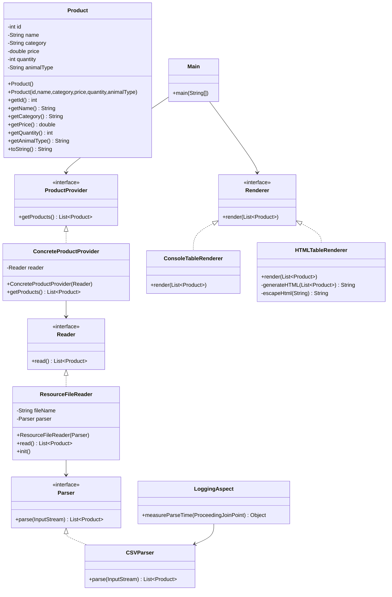

# Отчет о лабораторной работе 2

## Цель работы

Научиться конфигурировать Spring приложение с помощью аннотаций, использовать АОП для логирования и создавать HTML отчеты.

## Выполнение работы

### 1. Переход на конфигурацию с аннотациями

Все бины помечены аннотацией `@Component`. Вместо Java-конфигурации используется `@ComponentScan`.

### 2. Внешняя конфигурация

Создан файл `application.properties`:
``properties
products.file.name=products.csv

### 3. HTML рендерер

Создан класс HTMLTableRenderer, который генерирует HTML файл с таблицей товаров.

### 4.  Жизненный цикл бина

В ResourceFileReader добавлен метод @PostConstruct, выводящий дату и время инициализации.

### 5. АОП для замера времени

Создан аспект LoggingAspect с методом @Around для замера времени парсинга CSV.

### 6. UML диаграмма классов

### 7.Результат работы
Загрузка приложения...
[ResourceFileReader] Инициализирован: 2026-06-02 13:34:04
[ResourceFileReader] Загружаемый файл: products.csv
⏱️ [АОП] Метод parse выполнен за 2 мс
HTML отчет создан: C:\Users\ZAA\MyProject\cad-2025\les04\lab\app\products_report.html
Приложение завершило работу. 
 
## Вывод

Лабораторная работа выполнена полностью. В результате:
✅ Переведено конфигурирование на аннотации

✅ Добавлена внешняя конфигурация через application.properties

✅ Реализован HTML рендерер

✅ Добавлен вывод времени инициализации бина

✅ Реализован АОП аспект для замера времени парсинга

✅ Приложение успешно запускается командой gradlew run