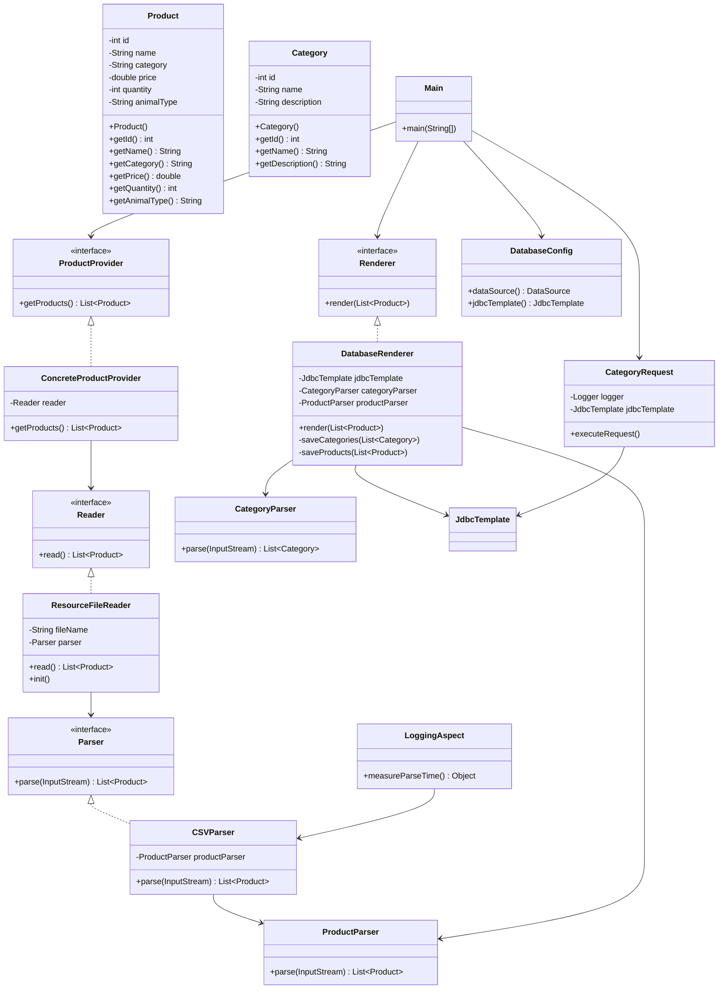

# Отчет о лабораторной работе 3

## Цель работы

Научить приложение сохранять данные в базе данных, выполнять SQL запросы и выводить результаты в логи с использованием JDBC, DataSource, JDBCTemplate и RowMapper.

## Выполнение работы

### 1. Подключение базы данных H2

В проект добавлена встраиваемая база данных H2 с использованием `EmbeddedDatabaseBuilder`:

java
@Bean
public DataSource dataSource() {
    return new EmbeddedDatabaseBuilder()
        .setType(EmbeddedDatabaseType.H2)
        .setName("zoomagazin_db")
        .addScript("classpath:schema.sql")
        .build();
}

### 2. Создание таблиц

SQL скрипт schema.sql создает две таблицы:

CREATE TABLE CATEGORIES (
    id INT PRIMARY KEY,
    name VARCHAR(100) NOT NULL,
    description VARCHAR(255)
);

CREATE TABLE PRODUCTS (
    id INT PRIMARY KEY,
    name VARCHAR(200) NOT NULL,
    category_id INT NOT NULL,
    price DECIMAL(10,2) NOT NULL,
    quantity INT NOT NULL,
    animal_type VARCHAR(50),
    FOREIGN KEY (category_id) REFERENCES CATEGORIES(id)
);

### 3. CSV файлы
category.csv - данные о категориях:

id,name,description
1,Корм,Сухие и влажные корма для животных
2,Гигиена,Товары для гигиены и ухода
3,Игрушки,Игрушки для животных
4,Добавки,Витамины и добавки
5,Аксессуары,Аксессуары для животных
6,Мебель,Мебель для животных
7,Жилища,Клетки и домики

products.csv - данные о товарах (с category_id):

id,name,category_id,price,quantity,animal_type
1,Корм Pedigree,1,2500,30,Собака
2,Наполнитель Fresh Step,2,800,50,Кошка
3,Игрушка-мяч Kong,3,450,25,Собака
4,Витамины Beaphar,4,600,15,Универсальное
5,Когтеточка Jungle Cat,5,1200,10,Кошка
6,Корм Tetra,1,350,40,Рыбка
7,Шампунь Espree,2,550,20,Универсальное
8,Лежанка Pet Palace,6,1800,8,Собака
9,Колесо Ferplast,5,950,12,Хомяк
10,Клетка Bella,7,3200,5,Птица

### 4. UML диаграмма классов

### 5.Результат работы

Загрузка приложения...
💾 Сохранение данных в базу H2...
   ✅ Сохранено категорий: 7
   ✅ Сохранено товаров: 10
   🔍 Проверка БД: 7 категорий, 10 товаров
✅ Данные успешно сохранены!

[INFO] === Категории с количеством товаров больше 1 ===
[INFO] Категория: Корм, Количество товаров: 2
[INFO] Категория: Гигиена, Количество товаров: 2
[INFO] Категория: Аксессуары, Количество товаров: 2
[INFO] Всего найдено: 3 категорий

Приложение завершило работу. 

База данных H2:

Создается в памяти при запуске

Таблицы: CATEGORIES (7 записей), PRODUCTS (10 записей)

Связь по внешнему ключу category_id
 
## Вывод

✅ Подключена встраиваемая база данных H2 через EmbeddedDatabaseBuilder

✅ Созданы таблицы CATEGORIES и PRODUCTS с внешним ключом

✅ Реализован парсинг CSV файлов для категорий и продуктов

✅ Создан DatabaseRenderer для сохранения данных в БД

✅ Реализован CategoryRequest с SQL запросом и логированием через logback

✅ Приложение запускается командой gradlew run и успешно завершается